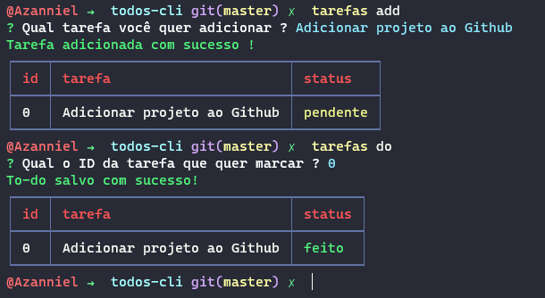

<div align="center">
  <h1>💻 Todos - CLI</h1>

  🚀 Uma ferramenta de linha de comando para criação de tarefas a serem feitas

  <a href="./LICENSE.md">
    
  </a>

  <a href="https://app.rocketseat.com.br/me/azanniel">
    
  </a>

</div>
<hr>
<br/>

## 🖼️ Prévia

A ferramenta funciona como uma chamada a uma ferramenta na linha de comando como na prévia



## 👷 Como instalar ?

Após baixar o repositório pelo github ou usando uma linha de comando siga os passos abaixo:

```bash

# Instale as dependências
$ npm install

# Execute o comando start
$ npm start

```

Este último comando irá fazer a build do projeto em uma pasta dist e após isso fazer o `npm link` que irá criar um comando em seu terminal para ser chamada a ferramenta.

## 👨‍💻 Como usar ?

Para utilizar a ferramenta basta digitar no terminal o comando `tarefas` que o mesmo irá responder com a lista de comando possíveis.

```bash
# Para saber mais sobre digite
$ tarefas -h

# Para adicionar uma tarefa
$ tarefas add 'Clonar projeto do github'

# Para listar as tarefas
$ tarefas list

# Para mudar o status como feito
$ tarefas do [ID da tarefa]

# Para mudar o status como pendente
$ tarefas undo [ID da tarefa]
```

e para saber mais sobre cada comando é só consultar o `tarefas --help` que irá lhe mostrar o que a ferramenta pode fazer

## 🏭 Tecnologias Utilizadas

O Projeto foi construído usando as seguintes tecnologias e ferramentas:
- **[Typescript](https://www.typescriptlang.org/)**
- **[Nodejs](https://nodejs.org/en/)**
- **[CommanderJs](https://github.com/tj/commander.js/)**
- **[Inquirer](https://github.com/SBoudrias/Inquirer.js/)**
- **[CLI Table](https://github.com/Automattic/cli-table)**
- **[Chalk](https://github.com/chalk/chalk)**
- **[Eslint](https://eslint.org/)**

## 📖 Licença

Realizado em 2020

Esse projeto está licenciado pela MIT LICENSE. Para mais informações, leia o arquivo [LICENSE](./LICENSE.md).
